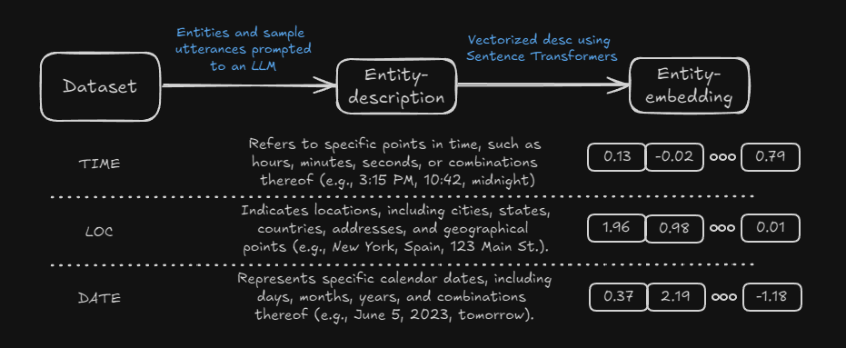

# nerfit: Few-shot entity representation learning

## Table of Contents

1. [Introduction](#introduction)
2. [Methods](#methods)


## Introduction

In the fast-evolving world of Machine Learning, innovative methods about building open-domain NER models have emerged. To be more precise:

* [nuNER](https://arxiv.org/abs/2402.15343) focuses on a contrastive pretraining of encoder models based on LLM-distilled data to make specific fine tuning on NER datasets faster. This approach, however, is not simple in terms of data acquisition, and does not provide an efficient way of tayloring a model to your data. In addition, constrastive learning pipelines tipically need large datasets *when dealing with open domain scenarios* in order to be properly calibrated, and encoder model is a copy of the original encoder, rather than a more reasonable approach like a [Sentence Transformers](https://arxiv.org/abs/1908.10084).
* [gliNER](https://arxiv.org/abs/2311.08526), on the other hand, approaches NER as a combination of encoder models and "entity-prompting" methods. Despite being this method an excellent option for generic entities (names, directions, locations, etc), it lacks specificity for more complex and subtle ones.
* [UniversalNER](https://arxiv.org/abs/2308.03279) takes a different view by leveraging knowledge distillation and emerging properties from LLMs to tag texts. Low effiency is the main drawback.

`nerfit` is conceived to bridge the gap between:

* Modularity: Build your model using any data, with any models, in any language. Democratization at its finest!
* Speed: Encoder models and parameter-efficient strategies make both training and inference blazing fast.
* Efficiency: A smart combination of weak and strong supervision overcomes large data needs in NER settings. Also, [Parameter Efficient Fine Tuning](https://github.com/huggingface/peft) methods can applied to enhance training stability and overall performance.
* Simplicity: Built upon [Huggingface's `Trainer` class](https://huggingface.co/docs/transformers/main_classes/trainer) to avoid rewriting boilerplate code. Adapt our `Trainer` class with your data parsing method, and you're good to go!


## Methods

### Overview

The `Trainer` object is responsible for managing the entire training pipeline, from data preparation to model optimization and evaluation. It encapsulates all the necessary components, including the model, tokenizer, data loaders, optimizer, and training loop. The `Trainer` is configured via the `TrainerConfig` class, which allows you to specify various parameters such as learning rates, batch size, and more.

However, given the rich variety of NER dataset formats available, it's not possible to rule them all. Instead, you have to prepare a small block of code to convert your annotations into the following schema, and encapsulate it into the `_parse_annotation` static method within the `Trainer`:

```
{
    'text': 'set an alarm for two hours from now',
    'entities: [17,35,'time']
}
```

For instance, [Alexa massive dataset](https://huggingface.co/datasets/AmazonScience/massive) annotations have the following format:

```text
[ORG: OpenAI] is based in [LOC: San Francisco].
```

Therefore, 

```python
# Libraries
import re
from typing import List, Union, Dict
from nerfit import Trainer

# Main class
class CustomTrainer(Trainer):
    @staticmethod
    def _parse_annotation(
        annotations:List[
            Union[
                Dict[str,str],
                Dict[str,List[List[str]]],
                Dict[str,List[Dict[str,Union[int,str]]]],
                str
            ]
        ]
    ) -> List[Dict[str,Union[str,int]]]:
        output = []
        for annotation in annotations:
            pattern = re.compile(r'\[(.*?): (.*?)\]')
            matches = pattern.finditer(annotation)
            text = annotation
            entities = []
            offset = 0
            for m in matches:
                entity = m.group(2).strip()
                label = m.group(1).strip()
                start_idx = m.start() - offset
                end_idx = start_idx + len(entity)
                entities.append([start_idx, end_idx, label])
                # Replace the annotated part with the entity name in the text
                annotated_text = m.group(0)
                text = text[:m.start()-offset] + entity + text[m.end()  -offset:]
                # Update the offset to account for the removed annotation
                offset += len(annotated_text) - len(entity)
            output.append({"text": text,"entities": entities})
        return output
```


### Entity-embeddings lookup table

One of the cornerstones of this project is to apply a token-level contrastive learning stage, based upon entities description embeddings provided by a [`Sentence Transformers`](https://sbert.net/) model. As we do not aim, however, to train open-domain models with a plethora of entities and descriptions resulting of LLM knowledge distilation (see nuNER reference), we can efficiently build a lookup mapping of entities and embedding representations, instead of dynamically compute them.




### Contrastive stage

An insightful idea taken from [nuNER](https://arxiv.org/abs/2402.15343) paper was to leverage weak supervision to tokens. There are some enhancements, however, that were adressed here:

* Original implementation used the same backbone for both token encoder and sentence-level representation. As BERT-like models do not excel in the latter, we use `SentenceTransformers` models instead; to make latent dimension between both models match, we include a final linear layer at the end of the token encoder, that is later dropped.
* That also give us higher flexibility to our data, in terms of lexical requirements, languages, etc.
* Entity descriptions embeddings are not dynamically computed; instead, we build a lookup table that is configured in every batch to our needs.
* Authors indicate that contrastive learning stage is fairly unstable if the whole neural network is optimized, and they opt for optimizing the last few layers of the neetwork instead. In our code, parameter efficient fine tuning methods are available to make this stage more robust and general.
* Training code is open source and available for everyone 🤗


### Training arguments

We have built a simple wrapper around `transformers` objects to save tons of time of writing boilerplate code; the usage is pretty simple:

```python
# Libraries
from safetensors.torch import safe_open
from nerfit import Trainer, TrainingArguments

# Load entity lookup table
ent2emb = {}
with safe_open("./tests/artifacts/ent2emb.safetensors", framework="pt", device="cpu") as f:
   for key in f.keys():
       ent2emb[key] = f.get_tensor(key)

# Load smaple data
with open('./tests/artifacts/sample_data.txt', 'r', encoding='utf-8') as f:
    annotations = f.read().split('\n')

#Configuration
args = TrainingArguments(
    model_name='roberta-base', # pick up any fill-mask model
    train_annotations=annotations[:100],
    val_annotations=annotations[100:200],
    ent2emb=ent2emb,
    peft_lora=True,
    peft_config={'lora_r':16,'lora_alpha':16,'lora_dropout':0.1, 'use_dora': True,'inference_mode': False},
    dataloader_num_workers=(2,2),
    per_device_train_batch_size=(8,8),
    per_device_eval_batch_size=(16,16),
    learning_rate=(5e-5,1e-5),
    weight_decay=(1e-2,1e-2),
    lr_scheduler_type='cosine',
    warmup_steps=(1000,500),
    fp16=True,
    gradient_accumulation_steps=(1,1),
    max_grad_norm=(1.,1.),
    seed=123,
    max_steps=(2500,1500),
    eval_strategy="steps",
    eval_steps=250,
    logging_strategy="steps",
    logging_steps=250,
    save_strategy="steps",
    save_steps=250,
)
```

Together with the previous `CustomTrainer` object, the usage is straightforward:

```python
trainer = CustomTrainer(args=args)
trainer.train()
```


## Contributing

Contributions are welcome! Please submit a pull request or open an issue to discuss improvements or bugs.

## License

This project is licensed under the MIT License.